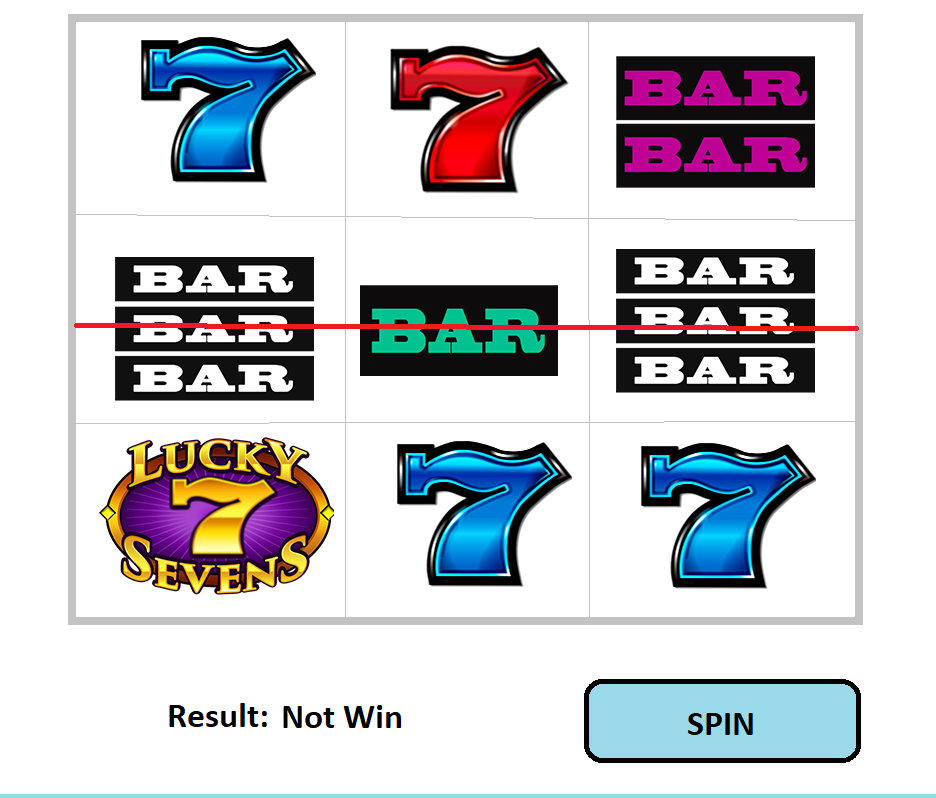

# Simple slot machine

# Launch
Launch a dev server in the project directory. Something like
```
$ python3 -m http.server
```

It will not work if simply open index.html (as a file in file manager) because Coco2D-js tries to load `project.json`, which fails for file protocol. 

# Requirements
The slot machine consists of 3 rows and 3 columns. 
Mockup:


Here are details about the slot machine behavior:

1. On the game screen should be a field with 3 reels, a winning indication area, and a single button “Spin”.

2. After pressing the “Spin” button, all reels start spinning (cells are moving down).

3. After 10 seconds of spinning all reels have to stop with some random combination.

4. Verify if 3 central cells have the same icon. If so, the game should show a winning message.

5. The “Spin” button should be available when reels stopped and unavailable during reels spinning.

